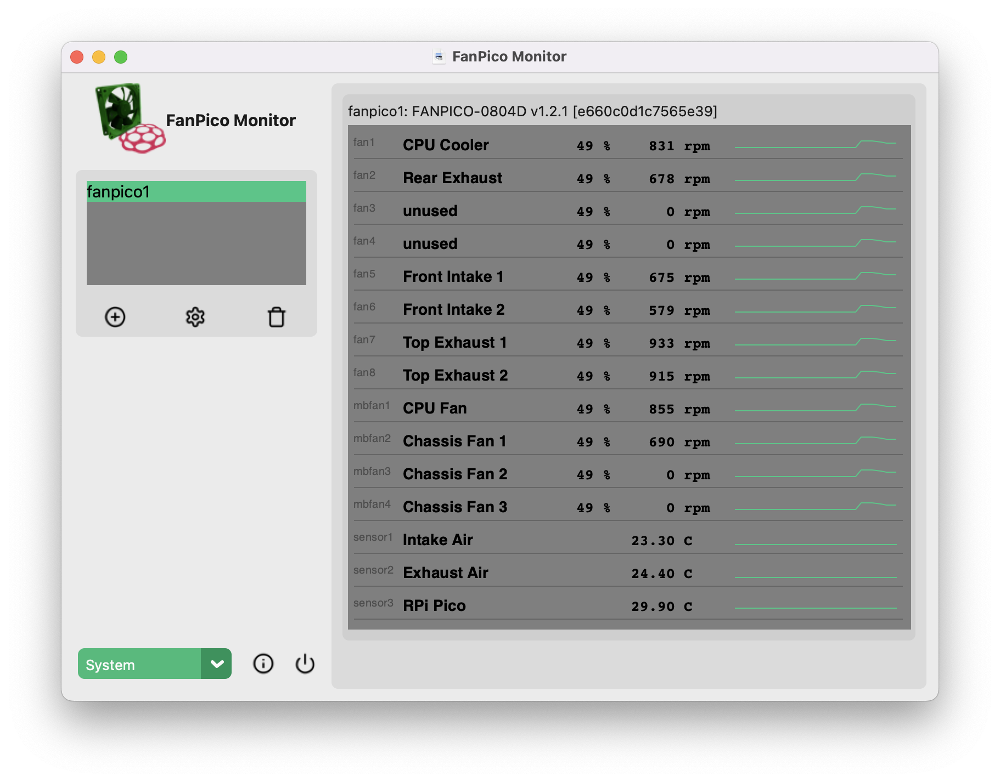

# fanpico-monitor
Application for monitoring [FanPico](https://github.com/tjko/fanpico/) units.

This is a simple desktop application for monitoring FanPico unit(s) written in Python so it works on Linux, MacOS and Windows.



Windows version looks similar: [Windows Version Screenshot](images/fanpico-monitor-win.png)


## Installing Dependencies

Install required modules using pip:

```
# pip3 install customtkinter
# pip3 install pyserial
# pip3 install pillow
```


## Acknowledgements

* GUI look/style: [CustomTkinter](https://github.com/TomSchimansky/CustomTkinter/)
* Icons: [Lucide](https://lucide.dev/)


